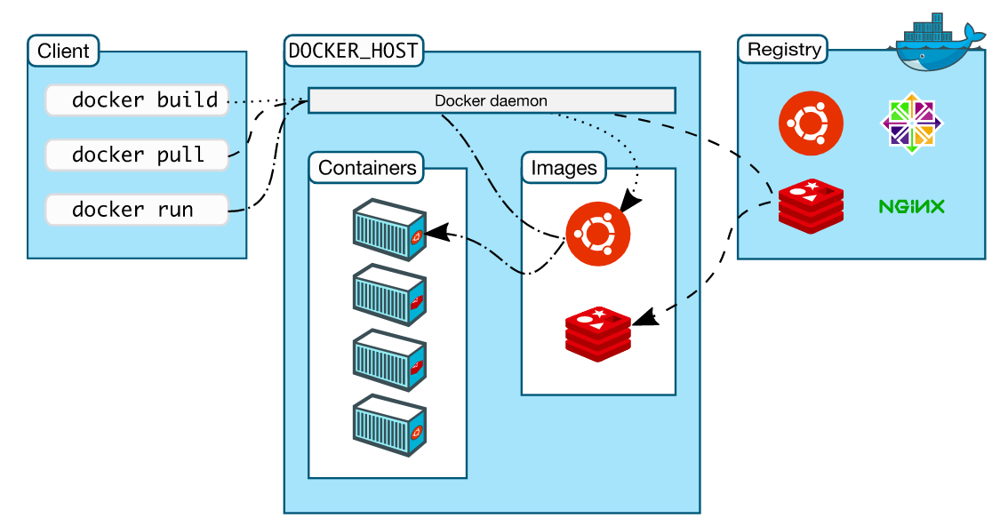

<!-- 2017/11/27 -->

# docker

发现用docker部署博客和搭建梯子很方便，所以学习了docker的使用并写了篇学习小结
<!--more-->

docker要求: linux内核3.10以上，并且64位

## 一、基本概念

1、docker概念：对进程进行封装隔离，属于操作系统层面的虚拟化技术。由于隔离的进程独立于宿主和其它的隔离的进程，因此也称其为容器。该容器是轻量、可移植的，可以发布到任何linux机器。

2 dockerfile: 使镜像构建透明化，不仅开发团队可以理解应用运行环境，也方便运维团队理解应用运行所需条件

3、概念

- 镜像: 特殊文件系统
- 容器: 镜像运行时的实体。
- 客户端: 通过命令行或者其他工具使用Docker API,与守护进程通信
- 主机: 一个物理或者虚拟的机器用于执行Docker守护进程和容器
- 仓库: 存储、分发镜像的服务。
- Machine:一个简化Docker安装的命令行工具，

## 二、镜像和容器

1、镜像的分层存储

Docker镜像是特殊文件系统，提供所需程序、库、资源、配置和配置参数。镜像不包含任何动态数据，其内容在构建后不会被改变。

镜像构建时，会一层层构建，前一层是后一层的基础。每一层构建完就不会再发生改变，后一层上的任何改变只发生在自己这一层。

2、容器运行

容器运行时，以镜像为基础层，创建容器存储层

## 三、安装docker

[官网：get docker ce for ubuntu](https://docs.docker.com/engine/installation/linux/docker-ce/ubuntu/)

```shell
# 移除老版本
sudo apt-get remove docker docker-engine docker.io
# 安装环境
sudo apt-get update
sudo apt-get install apt-transport-https \
  ca-certificates curl software-properties-common
# 添加gpg key
curl -fsSL https://download.docker.com/linux/ubuntu/gpg | sudo apt-key add -
sudo apt-key fingerprint 0EBFCD88
# 添加库(ubuntu16.04)
sudo add-apt-repository \
  "deb [arch=amd64] https://download.docker.com/linux/ubuntu \
  $(lsb_release -cs) stable"
# 添加库(ubuntu17.10)
sudo add-apt-repository \
  "deb [arch=amd64] https://download.docker.com/linux/ubuntu \
  $(lsb_release -cs) stable edge"
sudo apt-get update
sudo apt-get install docker-ce
# 安装成功
docker --help
```

## 四、使用docker



1、省略sudo: 加入用户组

```shell
sudo groupadd docker # 新建docker群组
sudo gpasswd -a perhaps docker # 将用户perhaps加入docker群组
sudo systemctl restart docker # 重启docker
newgrp docker # 登入docker群组
```

2、寻找镜像

- `docker search hello-world`

3、获取镜像

- `docker pull [OPTIONS] NAME[:TAG]`
- `docker pull hello-world`

4、运行镜像, 构建容器

```shell
docker images # 列举本地的镜像
docker run hello-world
```

5、构建镜像(需要Dockerfie文件)

- `docker build [OPTIONS] 上下文路径`
- `docker build -t demo:v1 .`

## 五、Dockerfile

`Dockerfile` 包含一条条的指令(Instruction)，每条指令构建一层

```shell
# Dockerfile demo
FROM python:2.7-slim
WORKDIR /app
COPY . /app
RUN pip install --trusted-host pypi.python.org -r requirements.txt
EXPOSE 80
ENV NAME World
CMD ["python", "app.py"]
```

指令详解：

- `FROM` 指定基础镜像，第一条指令
- `WORKDIR` 制定工作目录
- `COPY` 复制文件
- `RUN` 执行命令行
- `EXPOSE` 声明容器运行时提供的端口
- `ENV` 设置环境变量
- `CMD` 当容器启动时执行的命令
- `ENTRYPOINT` 比CMD高级点，可将docker命令行的内容作为自己的参数

## 六、参考文档

- [docker官方镜像](https://hub.docker.com/)
- [docker教程](https://yeasy.gitbooks.io/docker_practice/content/basic_concept/repository.html)
- [官网：get docker ce for ubuntu](https://docs.docker.com/engine/installation/linux/docker-ce/ubuntu/)
- [docker省略sudo命令](http://www.jianshu.com/p/cf59b0996aec)
