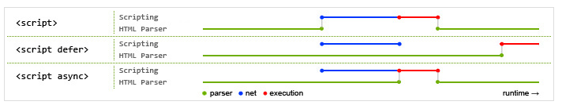

<!-- 2017/9/13 -->

# HTML资源的引用

属性`href`和`src`的区别，`script`元素中`defer`和`async`的区别， `iframe`跨域方案
<!--more-->

## 一、href和src的区别

href: hypertext reference，超文本引用，用于 `link` 和 `a` 元素，在当前元素和引用资源间建立联系。异步加载文件。
src: source， 表引用资源，替换当前元素，用于 `img，script，iframe` 上。同步加载文件。

```html
<link href="/favicon.ico" rel="icon" type="image/x-icon">
<link href="" rel="stylesheet" type="text/css">
<a href="" target='_self|_blank|_parent|_top'>链接</a>
```

```html

<script src=''></script>
<iframe src=''></iframe>
```

## 二、script

用于嵌套或引用可执行脚本

```html
<script src='' type='text/javascript'>
```

defer和async的区别

1. `<script src="script.js"></script>`: 浏览器会立即加载并执行脚本，
2. `<script src="script.js async"></script>`: 有 async，加载渲染文档元素过程和js的加载执行是异步的。
3. `<script src="myscript.js" defer></script>`: 有 defer，加载文档元素过程和js的加载是异步，但js的执行要在所有元素渲染完成后，DOMContentLoaded事件触发前完成。

图片解释：蓝色为网络读取时间，红色表执行时间，绿色为HTML解析。



小结：

- defer 和 async 的网络读取是一样的，但defer最接近脚本执行的要求
- defer按照顺序执行脚本，async则是乱序，先加载完的先执行

## 三、iframe

postMessage处理iframe跨域

`postMessage(value, url)` 发送消息

`onmessage = function(event) {console.log(event.data)}` 接收消息

父页面给子页面传信息

```html
// father.html
<body>
  <iframe src='http://example.com:8081/test.html' id='iframePage'></iframe>
  <input type='button' class='button'>
</body>
<script>
  document.querySelector('.button').addEventListener('click', function(event) {
    document.querySelector('#iframePage').contentWindow
            .postMessage('hello', 'http://example/com:8081')
  }, false)
</script>
```

```html
// child.html
<body>
  <div id='content'></div>
</body>
<script>
  window.addEventListener('message', function(event) {
    document.querySelect('#content').innerHTML = event.data
  }, false)
</script>
```

## 四、参考文档

- [超链接a的target属性](http://www.cnblogs.com/starof/p/4014691.html)
- [html的src和href的区别](http://www.cnblogs.com/tylerdonet/p/5808617.html)
- [defer和async区别](https://segmentfault.com/q/1010000000640869)
- [postMessage处理iframe跨域问题](https://segmentfault.com/a/1190000004512967)
