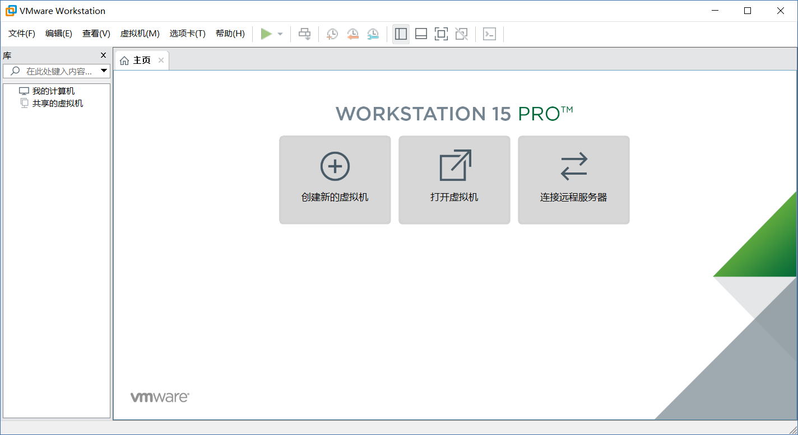

<!-- 2018/12/25 -->

# 刘畅同学的虚拟机安装

大概步骤：下载安装虚拟机 -> 下载ubuntu镜像 -> 在虚拟机里安装ubuntu镜像 -> 配置与使用

## 一、下载安装虚拟机

1、下载

`VMware Workstation` 是win常用的虚拟机软件，我们做计算机相关实验的时候也是用的这款软件，所以我推荐它。

然后我找的是简体中文破解版的，放在了百度网盘，你自己先下载下来

[虚拟机](https://pan.baidu.com/s/1rGg8OyPpZB0JwHMx36-_8g)

2、安装

解压后，得到下方的文件

双击 `VMware Workstation Pro` 安装软件

按步骤一直点下去，直到下面这一步 `安装位置` 的选择

最好不要放在c盘，所以点击 `更改` 把该软件安装到其他盘

得到更改目标文件夹，下方，`1` 表示选择更改文件夹，`2` 表示新建文件夹

你自己选择后文件夹后，就点击`确定`，按步骤下去，直到 `用户体验设置`，取消掉 `检查产品更新`，因为这个是破解版的，没必要更新

一直按步骤下去，就安装好了，然后会提示你要 `重新启动电脑`，那就重启吧~

3、打开软件--破解

会需要让你输入密钥，复制粘贴这段：`GV7N2-DQZ00-4897Y-27ZNX-NV0TD`，应该就行了

最终得到软件：

## 二、下载ubuntu镜像

ubuntu简体中文官网我下载不了，好奇怪，繁体中文官网却下载的比较慢(对于你而言，加速的话需要另一个渠道)，所以暂时选英文官网

[英文官网](https://www.ubuntu.com/download/desktop)

推荐安装 `Ubuntu 18.04.1 LTS`， LTS版本的都比较稳定，我以前就是用的 `ubuntu 16.10 lts`

安装好得到 `ubuntu-18.04.1-desktop-amd64.iso`

## 三、在虚拟机里安装ubuntu

待定。。
