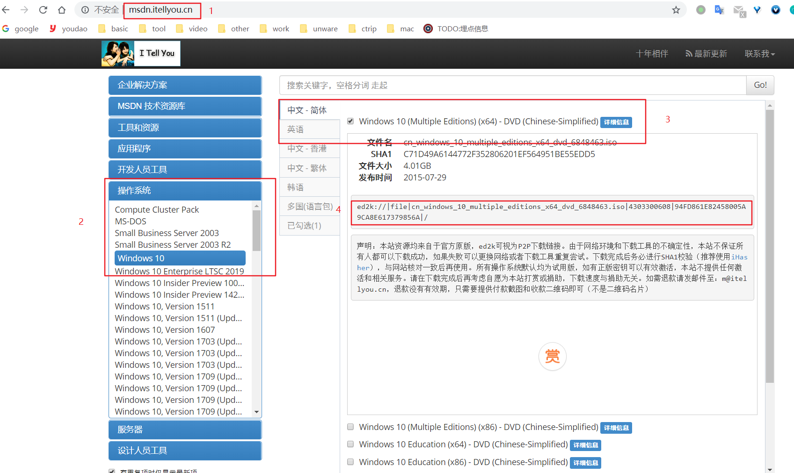
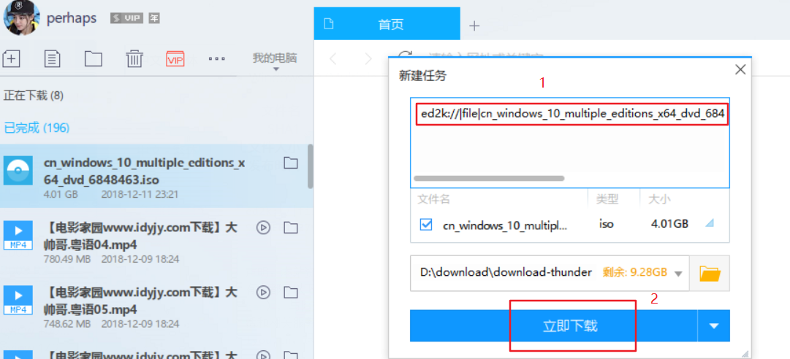
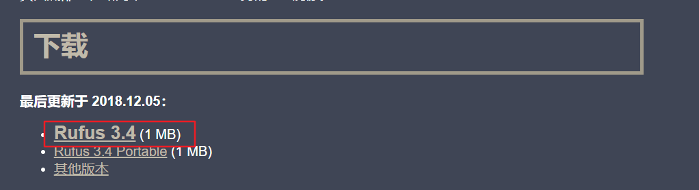
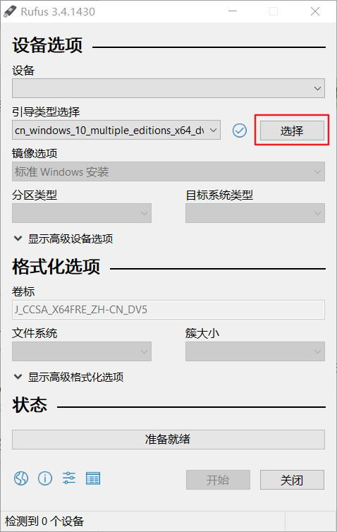
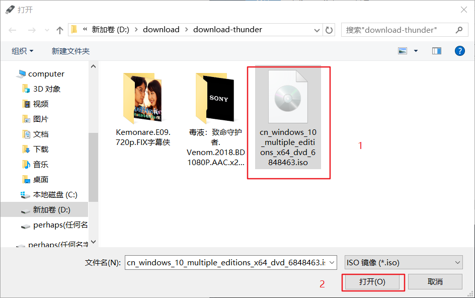
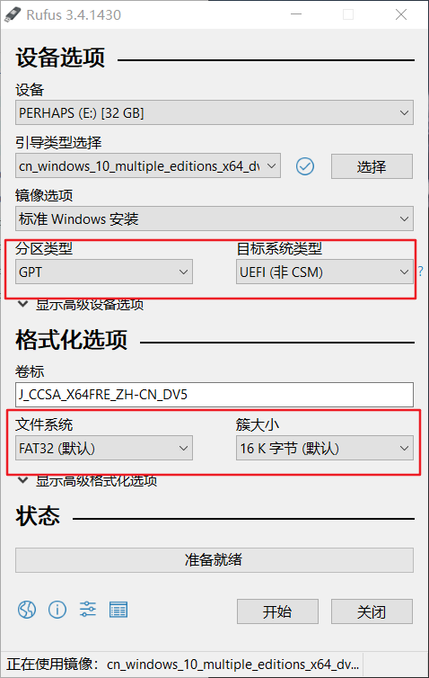
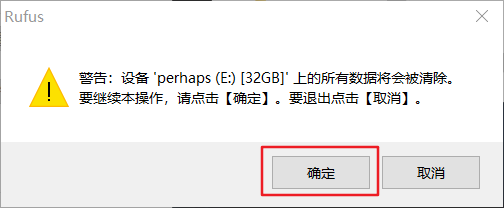
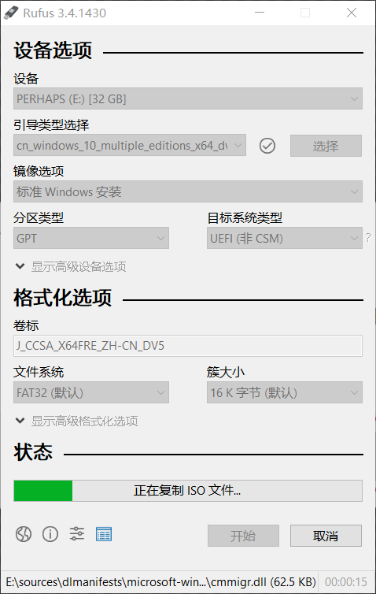

<!-- 2018/12/11 -->

# 系统重装

请用笔记本电脑进行下面的操作。

基本流程：  
制作u盘启动盘 -> 设置bios用u盘启动 -> 磁盘格式化和分区 -> 系统安装

安装完后，可能驱动会缺失，需要用`驱动精灵`安装必要的驱动

## 一、查找win10资源

[下载网站](http://msdn.itellyou.cn/)

根据红色数字`1234`，按下图找到对应的资源，复制`4`的链接

## 二、下载win10系统镜像

打开迅雷，新建任务，把刚刚的链接复制到任务上，点击`立即下载`

## 三、用refus制作u盘启动盘

1、下载并安装refus

[refus中文官网](https://rufus.ie/zh_CN.html)

点击红色框框下载refus软件

下载完后，双击`refus.exe`即可打开refus软件。

2、制作u盘启动盘

插入u盘(记得u盘不要有重要数据)，打开refus软件，点击`选择`

选择你刚刚下载好的win10镜像，点击打开

回到refus软件，然后`分区类型`、`目标系统类型`和`文件系统` 跟下面图片是一样的。点击`开始`

点击`确定`

过大概10分钟，u盘启动盘就制作好了

然后点击`关闭`

## 四、u盘重装系统

1、进入u盘系统

来到台式电脑，插上u盘，按f12开机启动，选择u盘进入系统

若是电脑没检测到u盘启动的话，解决方案如下：先是进bios，把安全模式关掉，把usb boot开启，把模式从uefi only改成传统模式

2、一步步装

具体细节忘记了

## 五、可能遇到的问题

1、无法在驱动器0分区上安装windows  

思路：硬盘格式问题，需要设置成gpt格式
步骤：  

(1) 当前安装界面按住Shift+F10调出命令行窗口  
(2) 输入`diskpart`，回车执行  
(3) 进入DISKPART命令模式，输入`list disk`回车，列出当前磁盘信息  
(4) 要转换磁盘0格式，则输入`select disk 0`回车，输入`clean`，删除磁盘分区  
(5) 输入`convert gpt` 把硬盘转为GPT格式  
(6) 输入`exit`回车退出窗口，返回安装界面继续安装系统

## 六、安装驱动

下载驱动精灵

[下载地址](http://www.drivergenius.com/)

然后到台式电脑安装这个软件
